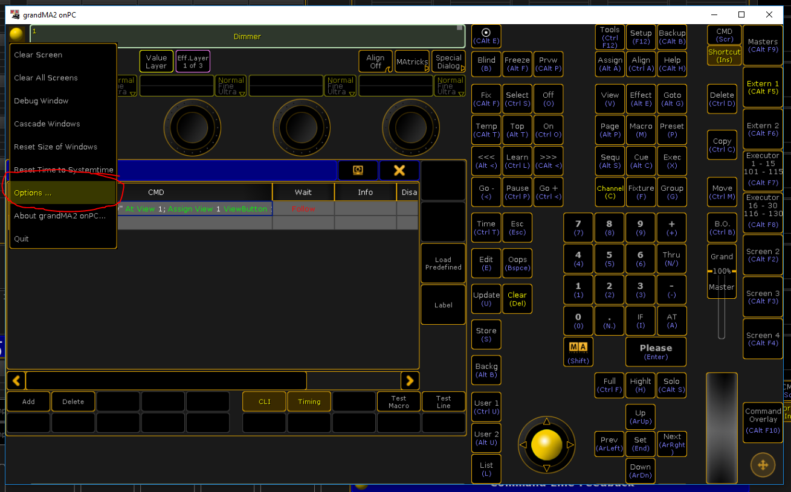
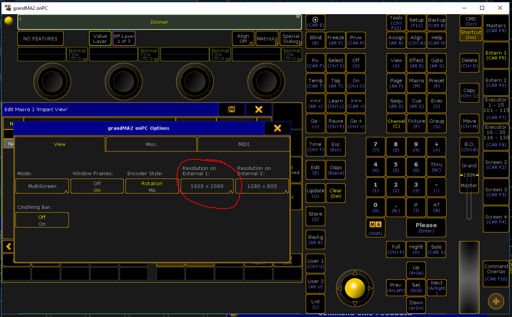

# APC40 Mark 1 Mapping (Single Controller)
This Akai APC40 Mark 1 single-controller mapping **with LED feedback** aims at giving MA2 onPC operators with an APC40 Mark 1 controller and a Full HD monitor access to 40 full-sized executors, 12 buttons executors (only one button + fader) and 4 button executors with fader-only control.  

On top of that 7 groups can be toggled selected and deselected and 16 "All" presets can be toggled on and off.

The focus of this mapping is live-playback (not on preprogramming).

## Prerequisites
Before downloading & installing this mapping, please go through the following list as a peparation

### Prerquisite #0: A Full HD Monitor
The view for this mapping was built for and with a Full HD monitor (1920px x 1080px) and won't work properly without a monitor like that.  

If you don't own a Full HD monitor yet, consider the fairly cheap DELL touch monitor which I reviewed in this video:  
https://www.youtube.com/watch?v=oBfwf3NR3ws 

### Prerequisite #1: Bome's Midi Translator Pro installed
Download it here: https://www.bome.com/products/miditranslator 

Demo mode runs for 20 minutes at a time and needs to be restarted after that.  
**Please buy the software to support the creator!**  

### Prerequisite #2: Extern 1 has Resolution 1920x1080
  
In the main window, click on the yellow ball in the upper-left corner, and click on "Options"  

  
Make sure the reoslution of your Extern 1 is set to 1920 x 1080 (Full HD)

### Prerequisite #3: Go to Button Page 6
  
To make button page 6 visible in MA2 (Page 6 is used by the APC40 view), click on "Bt Pg+" a few time.

### Prerequisite #4: Make the following slots available
The following slots will be used by the APC40 mapping - please make them available for use with the mapping:

**Groups**
- Group 1 thru 7

**"All" Presets**  
- Preset 0.1 thru 0.17

**Macros**
- Macro 1 thru 11

**Executors**  
- Executor 7.1 thru 7.10
- Executor 7.66 thru 7.75
- Executor 7.81 thru 7.90

**ButtonExecutors**  
- ExecButtons 6.131 thru 6.190

## Download & Install
**BEFORE YOU DO THIS, READ THE PREVIOUS SECTION!**

1. Make sure your setup & showfile are prepared as described in the previous section
2. Download & Import Plugin:  
    - Download [apc40-plugin.xml](https://raw.githubusercontent.com/aGuyNamedJonas/grandma2-snippets/master/apc40-mapping/apc40-plugin.xml) **and** [apc40-mapper.lua](https://raw.githubusercontent.com/aGuyNamedJonas/grandma2-snippets/master/apc40-mapping/apc40-mapper.lua) ◀ Right-click on links and save-as 
    - Move **both files** into `<show_folder>\plugins`  
    (e.g. into `C:\ProgramData\MA Lighting Technologies\grandma\gma2_V_3.3.4\plugins\apc40-plugin.xml`)
    - Copy & paste the following MA2 command to import the plugin:  
    `Import "apc40-mapper"  At Plugin 2`
3. Download & Import Macros:  
    - Download [apc40-macros.xml](https://raw.githubusercontent.com/aGuyNamedJonas/grandma2-snippets/master/apc40-mapping/apc40-macros.xml) ◀ Right-click and save-as 
    - Move file into `<show_folder>\macros\`  
    (e.g. into `C:\ProgramData\MA Lighting Technologies\grandma\gma2_V_3.3.4\macros\apc40-macros.xml`)
    - Copy & paste the following MA2 command to import the macros:  
    `Import "apc40-macros"  At Macro 1`
4. Download & Import View:  
    - Download [apc40-view.xml](https://raw.githubusercontent.com/aGuyNamedJonas/grandma2-snippets/master/apc40-mapping/apc40-view.xml) ◀ Right-click and save-as 
    - Move file into `<show_folder>\macros\`  
    (e.g. into `C:\ProgramData\MA Lighting Technologies\grandma\gma2_V_3.3.4\importexportmacros\apc40-view.xml`)
    - Copy & paste the following MA2 command to import the view:  
    `Import "apc40-view"  At View 1;  Assign View 1  ViewButton 1.31 /screen=5`
5. Download & Import Midi Mapping:  
    - Download [apc40-midi.xml](https://raw.githubusercontent.com/aGuyNamedJonas/grandma2-snippets/master/apc40-mapping/apc40-midi.xml) ◀ Right-click and save-as 
    - Move file into `<show_folder>\importexport\`  
    (e.g. into `C:\ProgramData\MA Lighting Technologies\grandma\gma2_V_3.3.4\importexport\apc40-midi.xml`)
    - Copy & paste the following MA2 command to import the midi mapping:  
    `cd /; cd RemoteTypes; import "apc40-midi" at MidiRemotes;`
    - Enter `cd /` to get back to the root of the showfile
6. Download the Bome's Midi Translator Pro [Project file](https://raw.githubusercontent.com/aGuyNamedJonas/grandma2-snippets/master/apc40-mapping/apc40Mapping.bmtp) ◀ Right-click and save-as 

## How to Use
Yeah there's no way in hell I'm typing that one out - just watch the video :)